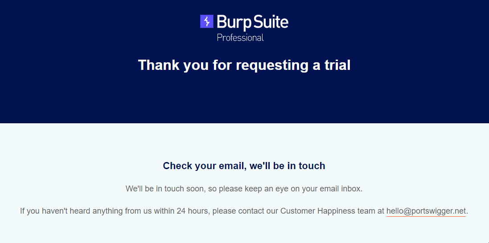

# 🟢 Prepare your Setup

Here I will explain my setup, for me, it works.  I hope it will work for you too.

We know the basic access is through a VPN I configure my account on a router and connect a switch to It.

### Local LAN for Exam Build&#x20;

### Router

This router will connect to my main router and firewall and I will configure the VPN connection to the Lab on it. I can get a more stable connection this way and avoid network/performance problems on the attacker machine.

### Switch

Just a cheap unmanaged switch to connect all machines needed to perform the exam.

### Buffer Overflows - Windows 7

Then I connected my Windows 7 machine dedicated to buffer overflows to the switch and my attack machine. Equipped with Immunity debugger and Mona.

And _Ghidra_ in case I am stuck...

### Attack Machine - Kali

Kali machine is fully updated, I know most people don't recommend this. After fully updating I start configuring all the Operating Systems and tools as I like.&#x20;

I wrote a script to this for me, you can use it:&#x20;

### Cracking Machine - Debian

I've my cracking machine prepared with all wordlists, keys, hashes, rainbow tables, and all the tools needed to create new wordlists.

And is connected to online APIs in case I can't break it at home... :joy:

### Burp Suite Professional

In case you enjoy burp suite and can't afford it like me I recommend creating a new professional email and subscribing for a new trial. Do this 3 days before the exam to ensure you receive the license key in time.

<figure><figcaption></figcaption></figure>

<figure><figcaption></figcaption></figure>

<figure><figcaption></figcaption></figure>

In 24 hours max in have our key.

<figure><figcaption></figcaption></figure>

Request it at: 01:05

Arrive at:&#x20;

Ping me on Discord in case you need an email to request your trial.



### Nessus Professional

Ok why Nessus? Why Not? I can do it by hand

<figure><figcaption></figcaption></figure>

<figure><figcaption></figcaption></figure>

#### [https://www.tenable.com/products/nessus](https://www.tenable.com/products/nessus)

Arrive 48 Hours later

